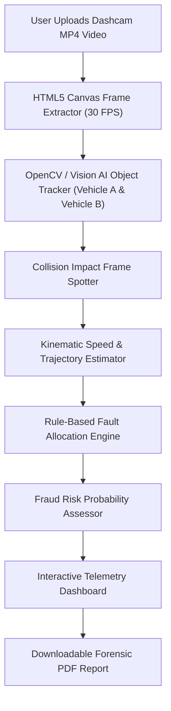

# 🚗 AccidentSight-AI: Project Blueprint & Implementation Guide

> **Tagline:** Automated CCTV & Dashcam Crash Forensic Analysis and Insurance Fraud Detection Engine

---

## 📌 1. Project Overview & Abstract

### **Title:**
`AccidentSight-AI: Automated Dashcam & CCTV Traffic Collision Reconstruction and Insurance Fraud Detection Engine`

### **Official Abstract:**
Road traffic collisions in India present significant challenges for insurance companies and law enforcement agencies due to prolonged investigation timelines (30–60 days), subjective human evaluations, and a rising surge in fraudulent claims. Traditional forensic analysis relies heavily on physical site inspection and verbal witness statements, which are often prone to human error and manipulation.

To resolve these bottlenecks, we propose **AccidentSight-AI**, an end-to-end web-based computer vision system designed to automate traffic crash reconstruction directly from MP4 dashcam and CCTV footage. Utilizing frame-by-frame canvas extraction, object detection trajectory tracking, and temporal impact analysis, the system automatically detects the precise frame of collision, pinpoints vehicle impact zones (e.g., front bumper vs. side door), and estimates pre-collision kinematic speeds. A rule-based forensic engine subsequently evaluates vehicle trajectories to compute an objective liability fault distribution (e.g., Vehicle A: 70% vs. Vehicle B: 30%) and calculates a fraud probability index.

Implemented using a modern full-stack architecture (**React.js, Node.js, Express, OpenCV/Vision AI, and Prisma**), AccidentSight-AI delivers real-time interactive telemetry dashboards and downloadable 1-page forensic PDF reports within seconds. The system eliminates physical hardware dependencies, allowing 100% web-browser-based testing and deployment, thereby revolutionizing insurance claim verification and traffic dispute resolution.

---

## 🎯 2. Target Audience & Problem Statement

### **Target Audience:**
1. **Insurance Claim Surveyors:** Rapid claim authentication within seconds without physical site visits.
2. **Traffic Police & Investigators:** Scientific, objective evidence for accident fault determination.
3. **Vehicle & Fleet Owners:** Indisputable video evidence reports for fast insurance payouts.

### **Problem Statement:**
* **Excessive Time Delays:** Physical claims processing takes 30 to 60 days.
* **Widespread Fraud:** Staged crashes and pre-existing car damage are fraudulently claimed, causing multi-crore losses.
* **Subjective Disputes:** Drivers give conflicting verbal statements, leaving no objective ground truth without manual camera review.

---

## 🏗️ 3. End-to-End System Architecture



---

## 💡 4. Detailed Feature Modules

### **Module A: Video Ingestion & Frame Extraction**
* Drag-and-drop MP4 video uploader supporting up to 1080p resolution.
* HTML5 Video Canvas API extracts video frames at 30 frames per second (FPS).

### **Module B: Object Detection & Trajectory Tracking**
* Tracks moving vehicles across sequential frames.
* Assigns persistent bounding boxes (Red for Vehicle A, Blue for Vehicle B).
* Calculates $(x, y)$ coordinate centroids for velocity estimation.

### **Module C: Impact Zone & Collision Detection**
* Pinpoints exact timestamp and frame index where bounding box overlap occurs.
* Maps collision points to vehicle polygons (e.g., Front Bumper, Side Door, Rear Panel).

### **Module D: Kinematic Speed & Fault Allocation Engine**
* Calculates pre-collision velocity ($\Delta d / \Delta t$) calibrated to standard road markings.
* Evaluates trajectory violations: Sudden Lane Change, Tailgating, Speeding, Failure to Yield.
* Computes mathematical Fault Percentage (e.g., Vehicle A: 70% | Vehicle B: 30%).

### **Module E: Fraud Risk Scoring & PDF Report Generator**
* Compares physical damage geometry against trajectory impact vectors to calculate Fraud Risk Score (0-100%).
* Generates a 1-page downloadable Forensic Investigation Report PDF.

---

## 🛠️ 5. Technology Stack

| Layer | Technology | Function |
| :--- | :--- | :--- |
| **Frontend UI** | React.js (Vite) + Tailwind CSS | Modern Glassmorphism Dashboard |
| **Video Processing** | HTML5 Canvas API + Frame Excerpt | In-browser video frame extraction |
| **AI / Vision Core** | Gemini 1.5 Flash Vision API / OpenCV.js | Collision detection & LLM forensic reasoning |
| **Backend API** | Node.js + Express.js + TypeScript | REST API & Analysis Orchestration |
| **Database** | PostgreSQL (via Prisma ORM) | Incident history & user reports storage |
| **PDF Generation** | `@react-pdf/renderer` or `jspdf` | Instant downloadable 1-page PDF reports |

---

## 🤖 6. Master Prompt Engineer System Prompt

Feed the following prompt to Gemini 1.5 Flash / GPT-4 Vision for frame analysis:

```text
SYSTEM PROMPT: TRAFFIC COLLISION FORENSIC ANALYZER ENGINE

[ROLE & IDENTITY]
You are "AccidentSight-AI Engine", a World-Class Traffic Collision Forensic Investigator, Automotive Kinematics Specialist, and Computer Vision Safety Auditor. Your task is to analyze sequential video frames or image snapshots of a vehicle crash (dashcam/CCTV footage) and generate a precise, objective, and mathematical crash reconstruction analysis.

[INPUT CONTEXT]
You will receive sequential video frames (Frame #1 to Frame #N) or key snapshots of a traffic incident, along with optional telemetry metadata.

[CHAIN OF THOUGHT ANALYSIS PROTOCOL]
You MUST execute your analysis following these strict sequential steps:

1. VEHICLE DETECTION & CLASSIFICATION:
   - Identify all primary moving entities (e.g., Vehicle A: Red SUV, Vehicle B: White Sedan, Pedestrian, Motorcycle).
   - Assign a persistent color-coded Bounding Box identifier to each vehicle across all frames.

2. IMPACT FRAME IDENTIFICATION:
   - Identify the EXACT frame number and timestamp where physical contact/bounding box overlap occurs (Impact Point).
   - Classify the specific anatomical collision zone on each vehicle (e.g., Vehicle A Front Left Bumper -> Vehicle B Rear Right Quarter Panel).

3. PRE-COLLISION KINEMATICS & TRAJECTORY EVALUATION:
   - Evaluate relative pixel displacement across the 10 frames prior to impact.
   - Estimate pre-collision speeds (km/h) for each vehicle.
   - Detect unsafe maneuvers: Sudden Lane Drift, Tailgating, Running Red Light, Failure to Yield Right-of-Way, Over-Speeding.

4. FAULT & LIABILITY ALLOCATION:
   - Calculate mathematical Fault Allocation Percentage (Totaling 100%).
   - Justify the fault percentage using Indian Motor Vehicles Act rules & global traffic safety protocols.

5. FRAUD PROBABILITY RATING:
   - Compare physical impact patterns against claimed damage.
   - Assign a Fraud Risk Percentage (0% to 100%) with a qualitative rating (LOW | MEDIUM | HIGH RISK).

[OUTPUT FORMAT]
You MUST respond STRICTLY in the following valid JSON format without any conversational filler or preamble:

{
  "incident_metadata": {
    "analysis_status": "SUCCESS",
    "total_frames_analyzed": 300,
    "impact_timestamp": "00:04.12",
    "impact_frame_index": 124
  },
  "vehicles": [
    {
      "id": "Vehicle_A",
      "type": "SUV",
      "color": "Red",
      "estimated_speed_kmh": 64.5,
      "impact_zone": "Front Left Bumper",
      "maneuver_detected": "Sudden Unindicated Lane Change"
    },
    {
      "id": "Vehicle_B",
      "type": "Sedan",
      "color": "White",
      "estimated_speed_kmh": 32.0,
      "impact_zone": "Rear Right Side Door",
      "maneuver_detected": "Straight Motion / Normal Driving"
    }
  ],
  "liability_analysis": {
    "fault_distribution": {
      "Vehicle_A": 70,
      "Vehicle_B": 30
    },
    "primary_cause": "Vehicle A initiated an abrupt lane change without signaling into Vehicle B's right-of-way.",
    "secondary_cause": "Vehicle B displayed a slightly delayed braking reaction time."
  },
  "fraud_assessment": {
    "fraud_risk_percentage": 12,
    "fraud_level": "LOW_RISK",
    "justification": "Impact damage geometry cleanly matches video kinematic trajectories."
  },
  "forensic_summary_text": "Vehicle A (Red SUV) traveling at 64.5 km/h collided with Vehicle B (White Sedan) at timestamp 00:04.12 due to an unindicated lane change. Liability is assigned at 70% to Vehicle A."
}
```

---

## 🗄️ 7. Database Schema (Prisma ORM)

```prisma
datasource db {
  provider = "postgresql"
  url      = env("DATABASE_URL")
}

generator client {
  provider = "prisma-client-js"
}

model IncidentReport {
  id               String       @id @default(uuid())
  reportNumber     String       @unique
  videoUrl         String
  fileName         String
  totalFrames      Int
  impactTimestamp  String
  impactFrameIndex Int
  faultVehicleA    Int          // e.g. 70%
  faultVehicleB    Int          // e.g. 30%
  primaryCause     String
  fraudRiskScore   Int          // 0 - 100%
  fraudLevel       String       // LOW_RISK | MEDIUM_RISK | HIGH_RISK
  pdfReportUrl     String?
  createdAt        DateTime     @default(now())
  vehicles         VehicleMetric[]
}

model VehicleMetric {
  id                String         @id @default(uuid())
  incidentId        String
  incident          IncidentReport @relation(fields: [incidentId], references: [id], onDelete: Cascade)
  vehicleTag        String         // Vehicle_A | Vehicle_B
  vehicleType       String         // SUV, Sedan, Bike, Truck
  color             String
  estimatedSpeedKmh Float
  impactZone        String
  maneuverDetected  String
}
```

---

## 💻 8. 100% Laptop Testing & Live Demo Guide

To demonstrate this system live on a laptop without physical cars or external hardware:

1. **Step 1:** Download any 10-second dashcam/CCTV car crash clip from YouTube or sample dataset.
2. **Step 2:** Open the **AccidentSight-AI** Web Application in Chrome/Edge browser.
3. **Step 3:** Drag and drop the MP4 video into the Upload Area.
4. **Step 4:** Click **"Run AI Forensic Analysis"**.
5. **Step 5:** Watch the live progress bar as HTML5 Canvas extracts 30 FPS video frames and sends frame snapshots to the AI API.
6. **Step 6:** View the interactive **Telemetry & Fault Dashboard** displaying:
   * Frame-by-frame Bounding Box Collision Visualizer.
   * Vehicle Speed & Impact Zone Badges.
   * Fault Percentage Radial Chart (Car A: 70% | Car B: 30%).
   * Fraud Risk Rating Badge.
7. **Step 7:** Click **"Download Official Forensic PDF Report"** to export the publication-ready PDF report.

---

## 📂 9. Project Directory Structure

```text
accidentsight-ai/
├── backend/
│   ├── prisma/
│   │   └── schema.prisma
│   ├── src/
│   │   ├── controllers/
│   │   │   └── forensic.controller.ts
│   │   ├── services/
│   │   │   ├── vision.service.ts
│   │   │   └── pdfGenerator.service.ts
│   │   ├── routes/
│   │   │   └── forensic.routes.ts
│   │   └── server.ts
│   ├── package.json
│   └── .env
├── frontend/
│   ├── src/
│   │   ├── components/
│   │   │   ├── VideoUploader.jsx
│   │   │   ├── FrameVisualizer.jsx
│   │   │   ├── TelemetryDashboard.jsx
│   │   │   └── PdfReportButton.jsx
│   │   ├── pages/
│   │   │   └── Dashboard.jsx
│   │   ├── App.jsx
│   │   └── main.jsx
│   ├── package.json
│   └── vite.config.js
└── README.md
```

---
*Created for AccidentSight-AI Fullstack Engineering Project.*
